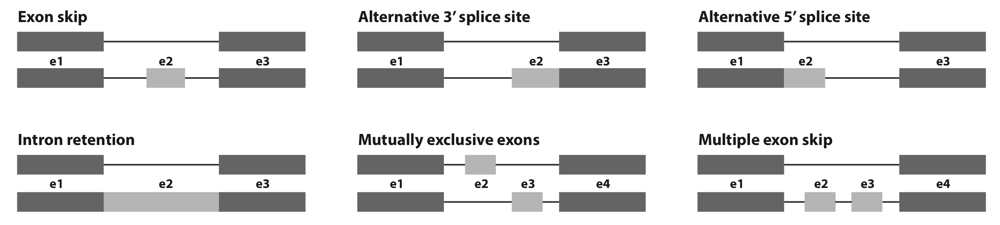

File formats
============

Input Files -- ``build`` mode
-------------------------------

Annotation Files
^^^^^^^^^^^^^^^^
SplAdder accepts two different formats for annotation files: GTF and GFF. It will automatically
detect the format from the file name ending, so please make sure that your annotation ends with
either ``gtf`` or ``gff``.
Most sources for genome annotation provide their files in one of these two formats. If you would
like to generate your own annotation files, please follow the respective specifications:

GTF:
    `ensembl`_
GFF:
    `broad`_, `ucsc`_

Alignment Files
^^^^^^^^^^^^^^^

All alignment files are expected to be in BAM format, following the `SAM format specification`_. We
have successfully tested SplAdder with the following aligners:
- `STAR`_
- `PALMapper`_
- `TopHat`_

Output Files -- ``build`` mode
--------------------------------
SplAdder produces a variety of different output files. Here we will mainly discuss files that are
aimed at the user and omit intermediate files that mainly necessary for internal processes of
SplAdder. Most of the latter will be stored in the ``spladder`` subdirectory in the output
directory.

After completing a SplAdder run, you will find several different output files in the output
directory. Following, we will describe each file type.

Annotation Files in GFF3 Format
^^^^^^^^^^^^^^^^^^^^^^^^^^^^^^^

These files have the general pattern
``merge_graphs_<event_type>_C<confidence_level>.confirmed.gff3`` and contain the events that have
been detected by SplAdder. Each event is shown as a mini gene consisting of two different isoforms.
If instance an exon skip would be described as::

    ##gff-version 3
    Chr1    exon_skip       gene    7616027 7616726 .       +       .       ID=exon_skip.1;GeneName="AT1G21690"
    Chr1    exon_skip       mRNA    7616027 7616726 .       +       .       ID=exon_skip.1_iso1;Parent=exon_skip.1;GeneName="AT1G21690"
    Chr1    exon_skip       exon    7616027 7616107 .       +       .       Parent=exon_skip.1_iso1
    Chr1    exon_skip       exon    7616603 7616726 .       +       .       Parent=exon_skip.1_iso1
    Chr1    exon_skip       mRNA    7616027 7616726 .       +       .       ID=exon_skip.1_iso2;Parent=exon_skip.1;GeneName="AT1G21690"
    Chr1    exon_skip       exon    7616027 7616107 .       +       .       Parent=exon_skip.1_iso2
    Chr1    exon_skip       exon    7616266 7616332 .       +       .       Parent=exon_skip.1_iso2
    Chr1    exon_skip       exon    7616603 7616726 .       +       .       Parent=exon_skip.1_iso2

For a definition of the different columns, please refer to one of the available GFF3 specifications
at `ensembl`_ or `ucsc`_. This file will allow you to display the events in a genome viewer such as
`UCSC Genome Browser`_, `IGV`_ or `GBrowse`_.

Event Files in HDF5 Format
^^^^^^^^^^^^^^^^^^^^^^^^^^

The event files contain all relevant event information and are stored in the hierarchical data
format `HDF5`_, allowing for efficient query, addition of data and interoperability between
different platforms and languages.
You can easily peek into the content of a hdf5 file::

    $> h5ls -r merge_graphs_exon_skip_C3.counts.hdf5

    /                        Group
    /conf_idx                Dataset {1}
    /confirmed               Dataset {2}
    /event_counts            Dataset {4, 7, 2}
    /event_features          Dataset {7}
    /event_pos               Dataset {2, 6}
    /gene_chr                Dataset {1}
    /gene_idx                Dataset {2}
    /gene_names              Dataset {1}
    /gene_pos                Dataset {1, 2}
    /gene_strand             Dataset {1}
    /num_verified            Dataset {4, 2}
    /iso1                    Dataset {4, 2}
    /iso2                    Dataset {4, 2}
    /psi                     Dataset {4, 2}
    /samples                 Dataset {4}
    /strains                 Soft Link {/samples}
    /verified                Dataset {4, 4, 2}

This example lists the contents of a hypothetical exon_skip event hdf5 file, containing the
information over 2 exon skips found in a cohort of 4 samples. The
tree that is shown looks a little bit like a file system tree and this is also the best analogy to
how the file is organized. Directories in the file system would correspond to groups in hdf5 and
files in file system to datasets in hdf5. Each group can contain more groups or datasets. 

The event hdf5 is structured as follows:

- **conf_idx**: 0-based index set, containing the index of the events that are confirmed in the provided samples
- **confirmed**: binary array indicating for each event whether it is confirmed or not
- **event_counts**: 3-dimensional matrix (S x F x E) containing counts for each of the E events, F features and S samples
- **event_features**: list containing the description of the counted features per event type
- **event_pos**: position of all event exons encoded as start,stop pairs for each event (events are rows, coordinates are columns)
- **gene_chr**: chromosome for each gene in the gene list
- **gene_idx**: index that maps each event to a gene in the gene list (0-based)
- **gene_names**: gene name for each gene in the gene list
- **gene_pos**: position of each gene in the gene list encoded as start,stop pair
- **gene_strand**: strand for each gene in the gene list
- **num_verified**: 2-dimensional count matrix (V x E) containing the number of samples where
  validation criterion V was met for event E
- **iso1**: 2-dimensional matrix (S x E) containing the number of spliced reads in sample S
  supporting isoform 1 in event E
- **iso2**: 2-dimensional matrix (S x E) containing the number of spliced reads in sample S
  supporting isoform 2 in event E:
- **psi**: 2-dimensional matrix (S x E) containing the percent spliced in (PSI) value for event E
  in sample S. PSI is computed as iso1 / (iso1 + iso2) 
- **samples**: names of the samples counted
- **strains**: names of the samples counted (kept for legacy)
- **verified**: 3-dimensional bool matrix (S x V x E) indicating whether validation criterion V for
  event E was met in sample S

**Naming of Features**

The naming of features follows a simple logic utilizing the numbering of exon segments as shown in the below
image. The numbering follows genomic coordinates. That is the below image shows the positive strand.
For the negative strand the numbering would need to be reversed. For instance to count the number of
spliced alignments that confirm the connection of exon segments `e1` and `e3` in an exon skip, the
corresponding feature name would be `e1e3_conf`.

The below list details the event features for each of the supported event types:

- **features alt3_prime / alt_5prime**: 
    * **valid**: contains a 1 if the event is valid and 0 otherwise
    * **e1_cov**: mean coverage of the first constant exon segment in the event
    * **e2_cov**: mean coverage of the exoni segment between the two alternative splice sites 
    * **e3_cov**: mean coverage of the second constant exon segment in the event
    * **e1e3_conf**: number of spliced alignments spanning the longer intron
    * **e2_conf**: number of spliced alignments spanning the shorter intron
- **features exon_skip**:
    * **valid**: contains a 1 if the event is valid and 0 otherwise
    * **e1_cov**: mean coverage of the left flanking exon (in genomic coordinates, ignoring strand)
    * **e2_cov**: mean coverage of the cassette exon
    * **e3_cov**: mean coverage of the right flanking exon (in genomic coordinates, ignoring strand)
    * **e1e2_conf**: number of spliced alignments spanning from left flanking to cassette exon
    * **e2e3_conf**: number of spliced alignments spanning from cassette to right flanking exon
    * **e1e3_conf**: number of spliced alignments spanning from left flanking to right flanking exon
- **features intron_retention**:
    * **valid**: contains a 1 if the event is valid and 0 otherwise
    * **e1_cov**: mean coverage of the left flanking exon (in genomic coordinates, ignoring strand)
    * **e2_cov**: mean coverage of the retained intron
    * **e3_cov**: mean coverage of the right flanking exon (in genomic coordinates, ignoring strand)
    * **e1e3_conf**: number of spliced alignments spanning the intron
    * **e2_cov_region**: fraction of positions in the intron that have a coverage > 0
- **features mult_exon_skip**:
    * **valid**: contains a 1 if the event is valid and 0 otherwise
    * **e1_cov**: mean coverage of the left flanking exon (in genomic coordinates, ignoring strand)
    * **e2_cov**: mean coverage over all skipped exons
    * **e3_cov**: mean coverage of the right flanking exon (in genomic coordinates, ignoring strand)
    * **e1e2_conf**: number of spliced alignments spanning from left flanking to cassette exon
    * **e2e3_conf**: number of spliced alignments spanning from cassette to right flanking exon
    * **e1e3_conf**: number of spliced alignments spanning from left flanking to right flanking exon
    * **sum_e2_conf**: number of spliced alignments spanning any of the introns between neighboring skipped exons
    * **num_e2**: number of skipped exons
    * **len_e2**: cumulative length of skipped exons
- **features mutex_exons**:
    * **valid**: contains a 1 if the event is valid and 0 otherwise
    * **e1_cov**: mean coverage of the left flanking exon (in genomic coordinates, ignoring strand)
    * **e2_cov**: mean coverage of the first skipped exon (first defined by genomic coordinates)
    * **e3_cov**: mean coverage of the second skipped exon (second defined by genomic coordinates)
    * **e4_cov**: mean coverage of the right flanking exon (in genomic coordinates, ignoring strand)
    * **e1e2_conf**: number of spliced alignments spanning from left flanking to first exon
    * **e2e4_conf**: number of spliced alignments spanning from left flanking to second exon
    * **e1e3_conf**: number of spliced alignments spanning from first to right flanking exon
    * **e3e4_conf**: number of spliced alignments spanning from second to right flanking exon

**Validation Criteria**

For each event type, SplAdder uses different empirical validation criteria to determine, whether the
called event is valid in a given sample. The overview of that information is provided in the
**verified** and **num_verified** fields in the HDF5 count file for each event type. This data also
forms the basis for deciding on the list of **confirmed** events. An event is kept as confirmed, if
each of the validation criteria is fulfilled in at least one sample. (This does not necessarily mean
it is the same sample for different criteria, as the aggregated counts from **num_verified** are
used for this decision.) The indices of all confirmed events are indicated in the **conf_idx** array
of the HDF5 count file for each event type.

Following, we provide a list of the validation criteria per event type:

- **Multiple Exon Skip**
    #. exon coordinates are valid (>= 0 && start < stop && non-overlapping) & skipped exon coverage >= FACTOR * mean(pre, after)
    #. inclusion count first intron >= threshold
    #. inclusion count last intron >= threshold
    #. avg inclusion count inner exons >= threshold
    #. skip count >= threshold
- **Intron Retention**
    #. counts meet criteria for min_retention_cov, min_retention_region and min_retetion_rel_cov 
    #. min_non_retention_count >= threshold

- **Exon Skip**
    #. coverage of skipped exon is >= than FACTOR * mean(pre, after)
    #. inclusion count of first intron >= threshold 
    #. inclusion count of second intron >= threshold
    #. skip count of exon >= threshold

- **Alt 3/5 Prime**
    #. coverage of diff region is at least FACTOR * coverage constant region
    #. both alternative introns are >= threshold 

- **Mutex Exons**
    #. coverage of first alt exon is >= than FACTOR times average of pre and after 
    #. coverage of second alt exon is >= than FACTOR times average of pre and after 
    #. both introns neighboring first alt exon are confirmed >= threshold
    #. both introns neighboring second alt exon are confirmed >= threshold

Event Files in TXT Format
^^^^^^^^^^^^^^^^^^^^^^^^^

Event files in txt format contain essentially the same information as the HDF5 files in a tab
delimited column format with one line per event and the following entries per line::

    1: chromosome of the event
    2: strand of the event
    3: unique event_id
    4: name of gene the event is located in
    5-5+n: start and stop coordinates of the event exons
    5+n and following: count values for each of the samples with the following layout (features are event type specific as defined above for HDF5 files:
        <sample1>:<feature1>
        <sample1>:<feature2>
        <sample1>:<feature3>
        ...
        <sample2>:<feature1>
        ...

The features defined per sample are the same as in the HDF5 files defined above. The number of
features thereby depends on the event type.

Files in PICKLE Format
^^^^^^^^^^^^^^^^^^^^^^

These files are for internal usage only and can be ignored. 
 
Output Files -- ``test`` mode
--------------------------------
In the testing mode, SplAdder generates both tabulated output as well as some images for diagnosing
properties of the data. The latter is still in beta mode. Please report an issue on the `tracker
<https://github.com/ratschlab/spladder/issues>`_ in case you should encounter any problems.

Files in TXT Format
^^^^^^^^^^^^^^^^^^^
The results of the ``test`` mode can be generally found in the ``testing`` subdirectory of the
SplAdder output folder. For each event type {ET} and confidence level {C}, several different
output files in text format are generated:

- ``test_results_C{C}_{ET}.tsv``
- ``test_results_C{C}_{ET}.gene_unique.tsv``
- ``test_results_extended_C{C}_{ET}.tsv``

In the following, we will provide more description for each of the files.

**Basic test output per event**

The basic outputs of testing are stored in the file ``test_results_C{C}_{ET}.tsv``. In addition to
the header, the file contains one line per tested event. It contains 15 columns carrying the
following information:

#. *event_id* -- ID of the event
#. *chrm* -- event location: chromosome/contig
#. *exon_pos* -- event location: exon position (start-stop:start-stop:...)
#. *alt_usage* -- list of binary values, indicating alternative usage of each exon (same order as in exon_pos)
#. *gene_id* -- ID of gene
#. *gene_name* -- Name of gene
#. *p_val* -- raw p-value from differential test
#. *p_val_adj* -- adjusted p-value from differential test
#. *dPSI* -- delta PSI (absolute difference between mean-PSI of group A and mean-PSI of group B)
#. *mean_event_count_A* -- mean support for tested splice path in group A
#. *mean_event_count_B* -- mean support for tested splice path in group B
#. *log2FC_event_count* -- log2 fold-change of mean support group A vs group B
#. *mean_gene_exp_A* -- mean gene expression of gene in group A
#. *mean_gene_exp_B* -- mean gene expression of gene in group B
#. *log2FC_gene_exp* -- log2 fold-change of gene expression group A vs group B

**Basic test output per gene**
The file ``test_results_C{C}_{ET}.gene_unique.tsv`` contains essentially the same information as the
basic test output per event, just made unique per gene. That is, if a gene contains multiple events
of the same type, here only the most significant one is reported. The columns are the same.

**Extended test output per event**
The file ``test_results_extended_C{C}_{ET}.tsv`` contains additional output for each tested event
and can be used for debugging purposes. The number of columns is variable and depends on the size of
the input groups used for testing. For the following explanation, we assume that input group A has
size 2 and input group B has size 3. The first 15 columns are identical to the basic event
output file. The additional columns are as follows:

16. *event_count:group_A_sample1* -- support for tested splice path in group A sample 1
#. *event_count:group_A_sample2* -- support for tested splice path in group A sample 2
#. *event_count:group_B_sample1* -- support for tested splice path in group B sample 1
#. *event_count:group_B_sample2* -- support for tested splice path in group B sample 2
#. *event_count:group_B_sample3* -- support for tested splice path in group B sample 3
#. *disp_raw* -- raw dispersion estimate for the tested event
#. *disp_adj* -- corrected dispersion estimate for the tested event

Diagnose Plots
^^^^^^^^^^^^^^

The testing mode can generate some diagnose plots (via ``--diagnose-plots``) that can help you
assess the data you are looking at. These plots are still in beta mode and might change in future
versions of SplAdder.

The plots reside in the SplAdder output directory in the folder ``testing/plots``. Currently, the
following plots are available:

Count distribution
  A plot showing the distribution of supporting counts and the gene expression over events per
  tested group / condition. The plot is available over raw counts and over log10 transformed counts.

MA plot
  A plot showing the log2 fold-change of each event over the mean normalized counts.

Dispersion
  Three plots showing the raw dispersion estimate, the dispersion fit and the adjusted dispersion..

QQ plot
  Quantile-quantile plots showing the distribution of p-values after testing over a uniform
  distribution to check for over-inflation. Available for raw and adjusted p-values.

Files in PICKLE Format
^^^^^^^^^^^^^^^^^^^^^^

Similar to ``build`` mode, these files are for internal usage only and can be ignored. 

.. _ensembl: http://www.ensembl.org/info/website/upload/gff.html
.. _broad: http://www.broadinstitute.org/annotation/argo/help/gff3.html
.. _ucsc: http://genome.ucsc.edu/FAQ/FAQformat.html#format3
.. _SAM format specification: https://samtools.github.io/hts-specs/SAMv1.pdf
.. _STAR: https://github.com/alexdobin/STAR
.. _PALMapper: http://www.raetschlab.org/suppl/palmapper/genomemapper-qpalma
.. _TopHat: https://ccb.jhu.edu/software/tophat/index.shtml
.. _UCSC Genome Browser: https://genome.ucsc.edu/cgi-bin/hgGateway
.. _IGV: http://www.broadinstitute.org/igv/
.. _GBrowse: http://gmod.org/wiki/GBrowse
.. _HDF5: https://www.hdfgroup.org/HDF5/

